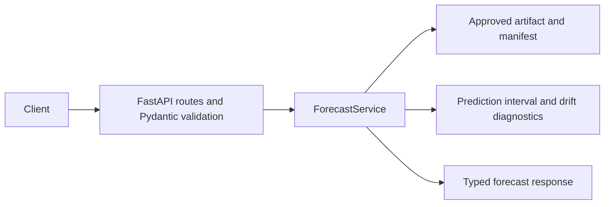
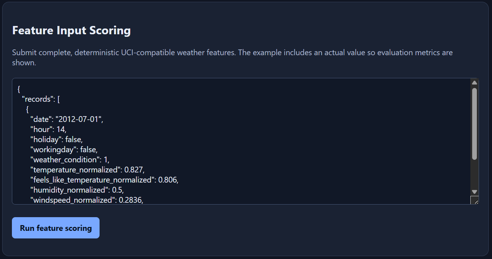
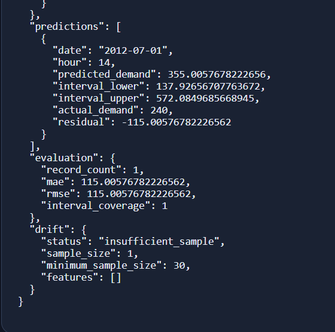

# Bike Demand Forecast API

A Docker-first FastAPI portfolio project that demonstrates a reproducible historical ML deployment: training, model promotion, approved-artifact inference, prediction intervals, and drift monitoring.

The API uses the UCI Capital Bikeshare hourly dataset, licensed under [CC BY 4.0](https://creativecommons.org/licenses/by/4.0/). The source data and attribution are included in `data/raw/`. [Dataset source](https://archive.ics.uci.edu/dataset/275/bike%2Bsharing%2Bdataset)

Review this project for ML deployment judgment—reproducibility, leakage control, model promotion, contract design, and operational boundaries—not as a claim of a state-of-the-art bike-demand model.

## Architecture at a glance



The model artifact is loaded once during application lifespan. Each request receives the existing `ForecastService` through FastAPI dependency injection; inference never retrains or reloads the artifact.

## Interactive API demo

Submit complete UCI-compatible features through the dashboard, then inspect the typed prediction response. The live dashboard and `/docs` expose the full response contract.

**Feature input**



**Prediction, evaluation, and drift response**



The one-record example supports prediction and evaluation, while correctly reporting `insufficient_sample` for drift because the configured monitoring minimum is 30 records.

## What it demonstrates

- Chronological 60%/20%/20% training, validation, and held-out test splits.
- Explicit exclusion of `casual` and `registered`, which sum to the target and would leak demand.
- Seasonal-median baseline versus a seeded XGBoost candidate.
- A 1% validation-MAE promotion threshold: XGBoost is approved only when the improvement is meaningful; otherwise the baseline remains deployed.
- A committed approved model artifact, JSON manifest, evaluation report, data fingerprint, feature-schema version, and persisted drift baseline.
- Deterministic feature-input scoring using complete UCI-compatible model features.
- Empirical 90% prediction intervals derived from validation residuals. These are not statistically guaranteed confidence intervals.

## Scope and interpretation

This is a self-contained historical model deployment and governance demonstration, not a claim of validated current Washington DC demand forecasting. The committed UCI observations span 2011-2012, and all reported metrics are from chronological splits of that period.

The rationale behind the baseline, promotion policy, intervals, drift treatment, and deliberately limited tuning is documented in [Modeling decisions](docs/modeling-decisions.md).

### Deliberate design boundaries

- **No request-time training:** training produces an approved, versioned artifact; the API only serves that artifact.
- **Explicit feature inputs:** callers provide the complete UCI-compatible feature contract. A live weather-provider endpoint was intentionally excluded because current weather alone would not make a historical 2011-2012 model a valid current-demand forecaster.
- **Compact monitoring demonstration:** the API returns per-request drift diagnostics, but does not claim to be a persistent monitoring or alerting platform.
- **No authentication:** this public demo has no user, tenant, private-data, or paid-access boundary. A production deployment would choose authentication based on its actual callers and authorization needs.

## Committed approved run

The committed `1.0.0` / feature-schema `1` artifact approved XGBoost over the seasonal-median baseline:

- Baseline validation MAE: `102.902`
- XGBoost validation MAE: `91.776` (a 10.81% improvement)
- Approved-model held-out MAE: `94.767`

The complete promotion decision, split periods, model parameters, interval calibration, drift reference distributions, and data fingerprint are available in `artifacts/approved/artifact_manifest.json`.

## Features and leakage boundary

The XGBoost candidate uses only features known at scoring time: cyclic hour and month representations, calendar-derived weekday, holiday and working-day flags, UCI weather condition, and normalized temperature, apparent temperature, humidity, and windspeed. The API derives calendar fields from `date`.

The UCI training data already supplies normalized weather fields, so the approved artifact does not contain a fitted scaler. Clients supply values in that inherited `0–1` feature contract when requesting predictions.

It intentionally excludes `casual` and `registered` because they sum to the target `cnt`, excludes `cnt` itself, and excludes the source-row identifier `instant`. The baseline uses training-only median demand grouped by hour, working-day flag, and month.

## Repository map

```text
bike_demand_api/  FastAPI application, request contracts, service, and ML utilities
scripts/          Training and artifact-verification entry points
artifacts/        Committed approved model bundle and manifest
data/raw/         Public UCI source data and attribution
tests/            Configuration and ML-behavior checks
docs/             Durable modeling and product-scope decisions
```

## Run with Docker

```powershell
docker build -t bike-demand-forecast-api .
docker run --rm -p 8000:8000 bike-demand-forecast-api
```

Optional non-secret runtime settings, including `LOG_LEVEL` and drift thresholds, are documented in `.env.example`. Docker only reads them when explicitly passed:

```powershell
Copy-Item .env.example .env
docker run --rm -p 8000:8000 --env-file .env bike-demand-forecast-api
```

Open [http://localhost:8000](http://localhost:8000) for the dashboard, [http://localhost:8000/docs](http://localhost:8000/docs) for interactive API documentation, and [http://localhost:8000/v1/model](http://localhost:8000/v1/model) for the approved-model metadata.

## Feature-input scoring

`POST /v1/forecasts` accepts complete UCI-compatible weather features. It is deterministic and is the preferred integration/testing path. Send `actual_demand` for every row to receive batch MAE, RMSE, and interval coverage; omit it for every row when actual demand is unknown.

```powershell
curl.exe -X POST "http://localhost:8000/v1/forecasts" `
  -H "Content-Type: application/json" `
  -d '{"records":[{"date":"2012-07-01","hour":14,"holiday":false,"workingday":false,"weather_condition":1,"temperature_normalized":0.827,"feels_like_temperature_normalized":0.806,"humidity_normalized":0.5,"windspeed_normalized":0.2836}]}'
```

`GET /v1/example-request` returns a ready-to-send feature-input payload.

## Training and artifacts

Run training locally from the committed source data:

```powershell
py -3.12 -m venv .venv
.\.venv\Scripts\Activate.ps1
python -m pip install -r requirements-dev.txt
python -m scripts.train
python -m scripts.verify_artifact
python -m pytest -q
```

Training writes the approved bundle to `artifacts/approved/`, the promotion and drift manifest alongside it, and a readable evaluation report in `reports/`. Inference never retrains.

The committed model is evaluated on historical 2011-2012 data. Its metrics describe that chronological holdout, not a claim of validated real-world demand accuracy for dates beyond the dataset period.

## Monitoring and errors

The artifact manifest stores reference distributions/bins from training. Drift requires at least 30 rows and returns per-feature PSI/category-shift diagnostics. Weather features are compared to month-by-hour training cohorts, weighted to the incoming batch's month/hour mix, so normal seasonal and hourly demand patterns do not look like weather drift. Runtime defaults are stable below `0.10`, watch from `0.10` through `0.25`, and drifted above `0.25`; override them through non-secret environment settings. Set `LOG_LEVEL` to `DEBUG`, `INFO`, `WARNING`, `ERROR`, or `CRITICAL`; blank or invalid values safely use `INFO`.

Responses include `X-Request-ID`. Expected failures use typed JSON responses: `422` invalid request, `503` unavailable artifact, `404` missing route, and `500` unexpected server error.

## CI

GitHub Actions compiles the project, verifies the committed approved artifact, runs the test suite, then builds the Docker image. It does not publish an image or deploy the project.
